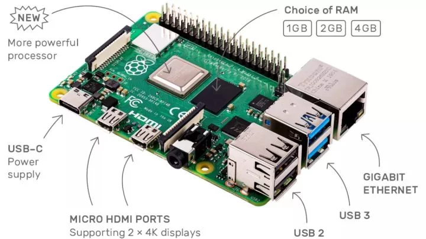
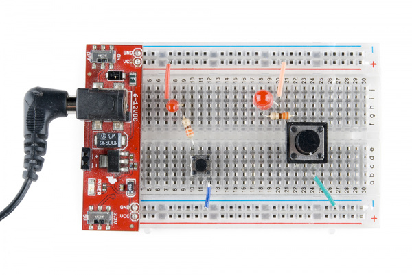

我们的智能控制系统, 应该是基于[Raspberry 4](https://www.zhihu.com/question/331141310)来部署在机器人上的. 配合[面包板](http://www.i-element.org/breadboard/)，实际上我们也可以自己设计简单的电路.
使用树莓派的关键, 是掌握[GIPO引脚的使用](https://zhuanlan.zhihu.com/p/40594358)，这也是树莓派最大的特点。 
工业级的应用，还是需要借助专业的电子工程师设计并印刷成专业的电路板. 工业级的控制系统应该已经在这样的框架下比较成熟了。python语言实际上也有支持嵌入式的分支，如[CircuitPython](https://forum.mianbaoban.cn/topic/71709_1_1.html)和[MicroPython](https://micropython.org/).

Raspberry的一个优势是很容易找到兼容的周边配件，但是，关注其他动能较单一的板子也有必要，这是从成本的角度去考虑的.
而且，大部分的周边元器件也可以配合面包板直接使用。下边的图片来源于[SparkFun](https://learn.sparkfun.com/tutorials/what-is-a-circuit), 一个介绍电子元配件很好的网站。
国内的[创元素](http://www.i-element.org/spaceorigin/)

实际上，我们的工作面临三个方面的问题：
* 如何解决虚拟环境下仿真和学习的问题
* 如何将仿真环境下学习到的知识迁移到demo上的问题
* demo的机械结构与真实的机械之间存在差异的问题

一个疑问：我们在实验室中使用的感知和控制电子元器件，是否可以（部分）直接运用到工业级的设备中？

  
在产品设计的过程中，我们应该坚持以问题为导向，不能拿着锤子找钉子.

