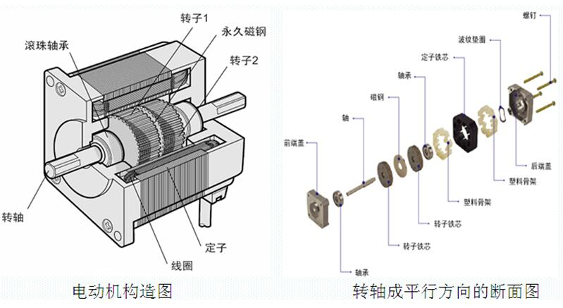
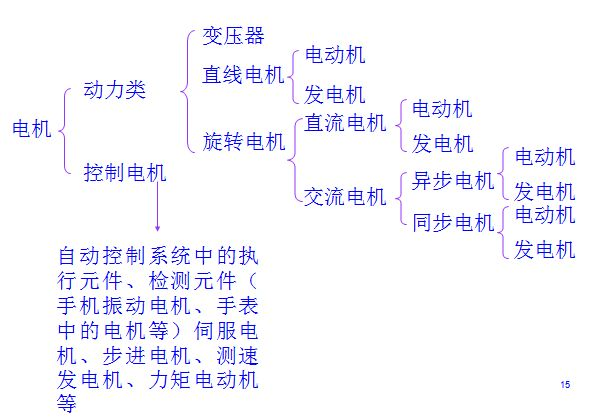
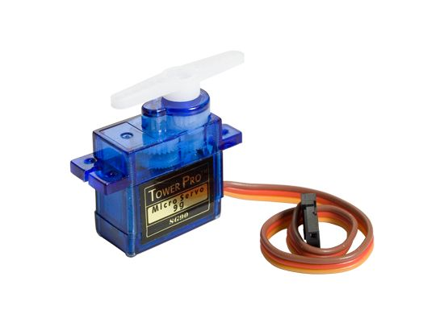
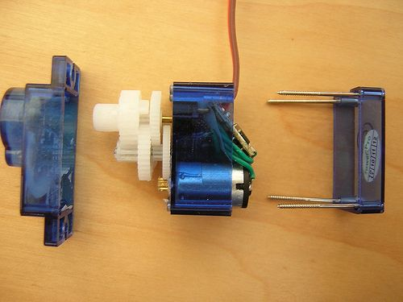

## 1. 伺服电机与步进电机    
从原理角度来看，只把最核心的定子转子算作电机。因此，当提及伺服电机和步进电机的时候，我们实际上指的是包括控制部件在内的整个体系。[知乎上的一个讨论](https://www.zhihu.com/question/37374664)。下图是一个电机的结构分解图示。

根据电机是否配备控制电路，电机可参考下图分为动力类电机和控制类电机：

### 1.1 步进电机
英文名Stepping Motor, 使用**开环**控制方式. 主要是依靠定子线圈序列通电，顺次在不同的角度形成磁场推拉转子旋转.
步进电机可以省掉用于测量电机转角的传感器. 因此在结构上和价格上有一定的优势, 而且它的位置和速度控制相对简单. 其缺点是, 首先, 与同等功率的电机相比载荷比较小, 没有角度传感器的情况下不能输出大力矩；其次, 功耗相对较大, 要么全开, 要么全关.

步进电机一般只用于载荷较小而且十分确定、位置精度要求并不非常高, 对体积敏感或在较低价格想要做到较高可靠性的场合. 最常见的就是光驱, 扫描仪, 复印机等等.
扫描仪在真正扫描之前, 要从滑轨一头先快速运动到另一头. 这实际上是系统在找位置零点. 那里面用的是一个步进电机, 它驱动扫描器运动.

### 1.2 伺服电机
英文名Servo Motor，采用的是**闭环**控制方式, 即通过传感器实时反馈电机的运行状态, 并将电压信号转化为转矩和转速以驱动控制对象, 由控制芯片进行实时调节.一般工业用的伺服电机都是三环控制，即电流环, 速度环和位置环, 分别能反馈电机运行的角加速度、角速度和旋转位置。芯片通过三者的反馈控制电机各相的驱动电流，实现电机的速度和位置都准确按照预定运行。

伺服电机能保证只要负载在额定范围内, 就能达到很高的精度, 具体精度首先受制于编码器的码盘, 与控制算法也有很大关系。与步进电机原理结构不同的是, 伺服电机由于把控制电路放到了电机之外, 里面的电机部分就是标准的直流电机或交流感应电机. 一般情况下电机的原始扭矩是不够用的, 往往需要配合减速机进行工作, 可以使用减速齿轮组或行星减速器. 伺服电机常用于需要高精度定位的领域，比如机床、工业机械臂、机器人等。

### 1.3 舵机
舵机其实是国人起的俗称, 因为航模爱好者们最初用它控制船舵、飞机舵面而得名. 伺服电机的英文是servomotor. 舵机也通常被称为servomotor, 有人简称为servo. 因此, 可以讲舵机理解为一种特殊结构的伺服电机. 从结构来分析, 舵机包括一个小型直流电机, 加上传感器、控制芯片、减速齿轮组, 装进一体化外壳. 能够通过输入信号（一般是PWM信号, 也有的是数字信号）控制旋转角度.

下边几张关于舵机的图片，可以帮助我们理解舵机的工作原理。

    

