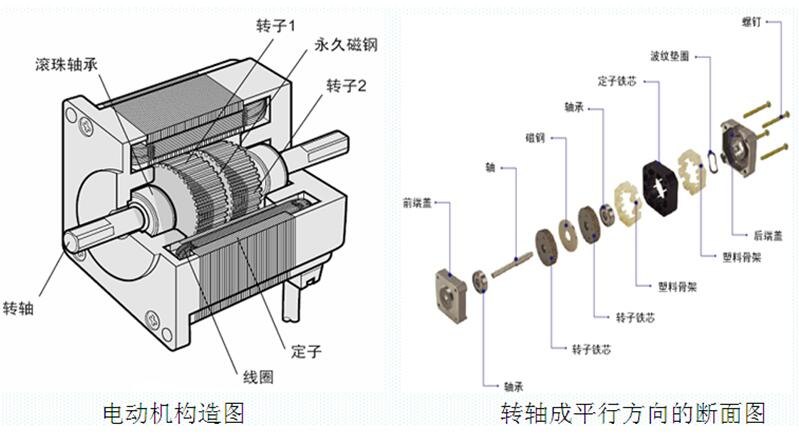

设置字体
<font face="黑体">我是黑体字</font>
<font face="微软雅黑">我是微软雅黑</font>
<font face="STCAIYUN">我是华文彩云</font>
<font color=red>我是红色</font>
<font color=#008000>我是绿色</font>
<font color=Blue>我是蓝色</font>
<font size=5>我是尺寸</font>
<font face="黑体" color=green size=5>我是黑体，绿色，尺寸为5</font>

<table><tr><td bgcolor=yellow>为字体添加背景色yellow</td></tr></table>

设置本地图片的百分比大小


设置本地图片的绝对值大小


设本地置图片居中：align=right，center，left
<div align=center></div>

> 这里是引用

[这是链接](https://www.jianshu.com/p/q81RER)

[百度](http://www.baidu.com/)

插入带链接的图片

[](http://www.baidu.com)

插入视频

[](http://v.youku.com/v_show/id_XMjgzNzM0NTYxNg==.html?spm=a2htv.20009910.contentHolderUnit2.A&from=y1.3-tv-grid-1007-9910.86804.1-2#paction)

`单行代码引用`


```python
NOC
targetFile = 'AB001-1_Th_free talk_20171026_110943_071.wav'
targetFolder = 'F:/Riku_Ka/testdata/AB001-1_voice/'
resultFolder = 'F:/Riku_Ka/testdata/AB001-1_voice/result/'
```

下边是分割线
***
---
___

行内公式引用$\alpha 1 + 1 = 2$
行外公式引用

$x=\frac{-b\pm\sqrt{b^2-4ac}}{2a}$

